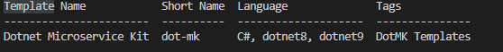

# Dotnet Microservice Kit Template

## What is this?
This project acts as a dotnet cli custom template when using `dotnet new`. This will scaffold a new microservice with the following features:

## Installation 
Install the template to your sdk `dotnet new -i <PATH TO REPO>`. This will create a new template for you to use: `dot-mk`.

1. Local installation

`cd template`
`dotnet build`
`dotnet new -i .`



2. Online installation
dotnet new -i <PATH TO REPO>

#### Uninstalling
1. `dotnet new -u`
    * This will produce output that looks like 
    ```
    ...
    Templates:
      Dotnet Microservice Kit (dot-mk) C#, dotnet8, dotnet9
    Uninstall Command:
      dotnet new uninstall C:\Nca\dotnet-microservice-kit\template
    ...
2. Run the uninstall command for the `dot-mk` template

#### Upgrading
When upgrading, it is best practice to uninstall the template and then re-install after you have pulled the latest

## Usage

| Parameter | Description |
|---|---|
| projectName `-P`  | Standard project name for the template. Used as prefix for all files and namespaces eg (`ProjectName.Api`) |
| repoName `-r`  | The name of the repository. In most cases will be the same value as `Output` |
| output `-o`  | The output directory. Defaults to the current directory. In most cases will be the same value as `repoName` |

**__If `-o` is not supplied the project will be created in the current working directory__**

**__In most cases `repoName (-r)` and `output (-o)` will be the same. Due to the cli they needed to be different parameters__**

`dotnet new dot-mk -p <PROJECT NAME> -r <REPO NAME> -o <NEW FOLDER NAME>`

## Example
`dotnet new dot-mk -p <SERVICE NAME> -r <SERVICE NAME> -o ./src/services/<SERVICE NAME>`

Create category service
`dotnet new dot-mk -p category -r category -o ./src/services/category`
